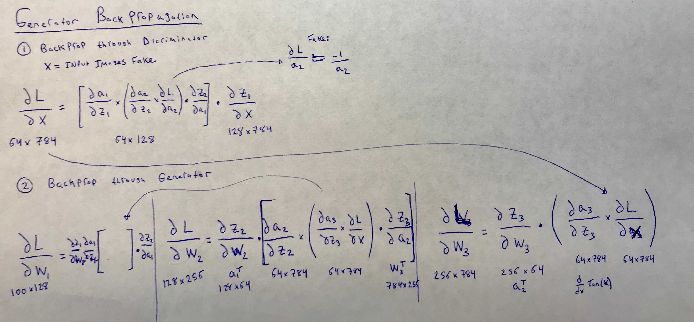

# Generative Adversarial Networks in PyTorch & Numpy:

A few variations of generative adversarial networks coded in Pytorch & Numpy to improve my theoretical understanding and to gain exposure with Pytorch software. Summary of results and code is provided below for each variant. Open to suggestions and feedback.


## Table of Contents: 
* [GAN numpy](#GAN-numpy)
* [GAN](#GAN)
* [CGAN](#CGAN)


## GAN numpy
A simple GAN constructed using Numpy. Pytorch is only used to load MNIST data for training. To output meaningful results select only a individual digit from MNIST. Results are so-so but documentation is provided below as the basic theory applies to all Pytorch GANs to follow. 
[**[Code]**](https://github.com/longenbach/GANs_PyTorch/blob/master/code/GAN_numpy.py)
<p float="center">
  
   
  
  
</p>


#### Weight Initialization
Due to the Relu activations in the hidden layers that follow the inputs of the generator and discriminator, the [Kaiming He initialization](https://arxiv.org/pdf/1502.01852.pdf) is used. This initializes weights to have variance equal to 2 / # of input nodes.

```python 
## Intial Generator Weights:
self.G_W1 = np.random.randn(self.noise_dim, 128) * np.sqrt(2. / self.noise_dim) # 100 x 128
self.G_b1 = np.zeros((1, 128)) # 1 x 128

self.G_W2 = np.random.randn(128, 256) * np.sqrt(2. / 128) # 128 x 256
self.G_b2 = np.zeros((1, 256)) # 1 x 256

self.G_W3 = np.random.randn(256, self.img_size ** 2) * np.sqrt(2. / 256) # 256 x 784
self.G_b3 = np.zeros((1, self.img_size ** 2)) # 1 x 784

## Intial Discrimnator Weights::
self.D_W1 = np.random.randn(self.img_size ** 2, 128) * np.sqrt(2. / self.img_size ** 2) # 784 x 128
self.D_b1 = np.zeros((1, 128)) # 1 x 128

self.D_W2 = np.random.randn(128, 1) * np.sqrt(2. / 128) # 128 x 1
self.D_b2 = np.zeros((1, 1)) # 1 x 1
```

#### Generator Architecture:


```python 
## Generator:
def generator_forward(self, noise):
    self.G_a1 = self.hidden_layer_forward(noise,self.G_W1,self.G_b1,acitvation='lrelu',ns=0)
    self.G_a2 = self.hidden_layer_forward(self.G_a1,self.G_W2,self.G_b2,acitvation='lrelu',ns=0)
    self.G_a3 = self.hidden_layer_forward(self.G_a2,self.G_W3,self.G_b3,acitvation='tanh')
    '''ADD MORE LAYERS'''
    return self.G_a3
```

#### Discriminator Architecture:


```python 
## Discriminator:
def discriminator_forward(self, img):
    self.D_a1 = self.hidden_layer_forward(img,self.D_W1,self.D_b1,acitvation='lrelu')
    self.D_a2 = self.hidden_layer_forward(self.D_a1,self.D_W2,self.D_b2,acitvation='sigmoid')
    '''ADD MORE LAYERS'''
    return self.D_a2
```

#### Discriminator Backward Pass:
Best to write out the tedious part. We assume Real images have labels=1 and Fake images=0 when calculating the derivative of the standard cross entropy loss (dDLoss). For the both Real and Fake images — working from the last layer towards the first layer — we compute and store the derivatives of the loss with respect to the weights and biases. The Real and Fake losses are combined and then used to update the weights and biases of the discriminator. 


```python 
def discriminator_backward(self, x_real, a_real, x_fake, a_fake, batch_size):
    '''Discriminator Real Loss: '''
    dL_da2 = self.dDLoss(a_real, y="real", eps=1e-8) # 64x1
    da2_dz2 = self.hidden_layer_backward(a_real, acitvation='sigmoid') # a_real = self.D_a2
    dz2_dW2 = self.D_a1.T #64x128
    dz2_db2 = np.ones(a_real.shape[0]) #64x1

    dL_dW2_real = np.dot(dz2_dW2, (da2_dz2 * dL_da2))
    dL_db2_real = np.dot(dz2_db2, (da2_dz2 * dL_da2)) 

    dz2_da1 = self.D_W2.T
    da1_dz1 = self.hidden_layer_backward(self.D_a1, acitvation='lrelu')
    dz1_dW1 = x_real.T
    dz1_db1 = np.ones(a_real.shape[0])

    dL_dW1_real = np.dot(dz1_dW1, da1_dz1 * np.dot((da2_dz2 * dL_da2),dz2_da1) ) 
    dL_db1_real = np.dot(dz1_db1, da1_dz1 * np.dot((da2_dz2 * dL_da2),dz2_da1) ) 

    '''Discriminator Fake Loss: '''
    dL_da2 = self.dDLoss(a_fake, y="fake", eps=1e-8)
    da2_dz2 = self.hidden_layer_backward(a_fake, acitvation='sigmoid') # a_fake = self.D_a2
    dz2_dW2 = self.D_a1.T
    dz2_db2 = np.ones(a_fake.shape[0])

    dL_dW2_fake = np.dot(dz2_dW2, (da2_dz2 * dL_da2))
    dL_db2_fake = np.dot(dz2_db2, (da2_dz2 * dL_da2)) 

    dz2_da1 = self.D_W2.T
    da1_dz1 = self.hidden_layer_backward(self.D_a1, acitvation='lrelu')
    dz1_dW1 = x_fake.T
    dz1_db1 = np.ones(a_fake.shape[0])

    dL_dW1_fake = np.dot(dz1_dW1, da1_dz1 * np.dot((da2_dz2 * dL_da2),dz2_da1) ) 
    dL_db1_fake = np.dot(dz1_db1, da1_dz1 * np.dot((da2_dz2 * dL_da2),dz2_da1) ) 

    '''Discriminator Combined Loss: '''
    dL_dW2_total = dL_dW2_real + dL_dW2_fake 
    dL_db2_total = dL_db2_real + dL_db2_fake

    dL_dW1_total = dL_dW1_real + dL_dW1_fake 
    dL_db1_total = dL_db1_real + dL_db1_fake

    '''Update Discriminator Weights: '''
    self.D_W1 -= self.lr * dL_dW1_total 
    self.D_b1 -= self.lr * dL_db1_total 

    self.D_W2 -= self.lr * dL_dW2_total 
    self.D_b2 -= self.lr * dL_db2_total 
    return None
```

#### Generator Backward Pass:
This is when you really appreciate the Pytorch (```g_loss.backward()``` and ```optimizer_G.step()```). The generator loss (dGLoss) is essentially opposite as the generator tries to maximize the likelihood of discriminator being wrong. Before updating the weights and biases of the generator we first pass the loss of the Fake images (dGLoss) through the fixed discriminator (dL_dx). Once (dL_dx) is calculated — working from the last layer towards the first layer — we compute and update the derivatives of the loss with respect to the weights and biases for the generator. 


```python 
def generator_backward(self, noise, a_fake,batch_size): 
    '''Discriminator Loss: '''
    dL_da2 = self.dGloss(a_fake, y="fake", eps=1e-8)
    da2_dz2 = self.hidden_layer_backward(a_fake, acitvation='sigmoid')
    dz2_da1 = self.D_W2.T
    da1_dz1 = self.hidden_layer_backward(self.D_a1, acitvation='lrelu')
    dz1_dx = self.D_W1.T

    dL_dx = np.dot(da1_dz1 * np.dot((da2_dz2 * dL_da2), dz2_da1), dz1_dx)

    '''Generator Loss: '''
    da3_dz3 = self.hidden_layer_backward(self.G_a3, acitvation='tanh')
    dz3_dW3 = self.G_a2.T
    dz3_db3 = np.ones(a_fake.shape[0])

    dL_dW3 = np.dot(dz3_dW3, (da3_dz3 * dL_dx))
    dL_db3 = np.dot(dz3_db3, (da3_dz3 * dL_dx))

    dz3_da2 = self.G_W3.T
    da2_dz2 = self.hidden_layer_backward(self.G_a2, acitvation='lrelu',ns=0)
    dz2_dW2 = self.G_a1.T
    dz2_db2 = np.ones(a_fake.shape[0])

    dL_dW2 = np.dot(dz2_dW2, da2_dz2 * np.dot( (da3_dz3 * dL_dx), dz3_da2))
    dL_db2 = np.dot(dz2_db2, da2_dz2 * np.dot( (da3_dz3 * dL_dx), dz3_da2))

    dz2_da1 = self.G_W2.T
    da1_dz1 = self.hidden_layer_backward(self.G_a1, acitvation='lrelu',ns=0)
    dz1_dW1 = noise.T
    dz1_db1 = np.ones(a_fake.shape[0])

    dL_dW1 = np.dot(dz1_dW1, da1_dz1 * np.dot( (da2_dz2 * np.dot( (da3_dz3 * dL_dx), dz3_da2)), dz2_da1))
    dL_db1 = np.dot(dz1_db1, da1_dz1 * np.dot( (da2_dz2 * np.dot( (da3_dz3 * dL_dx), dz3_da2)), dz2_da1))

    '''Update Generator Weights: '''
    self.G_W1 -= self.lr * dL_dW1 
    self.G_b1 -= self.lr * dL_db1 

    self.G_W2 -= self.lr * dL_dW2 
    self.G_b2 -= self.lr * dL_db2 

    self.G_W3 -= self.lr * dL_dW3 
    self.G_b3 -= self.lr * dL_db3 

    return None
```


## GAN:

[**[Code]**](https://github.com/longenbach/GANs_PyTorch/blob/master/code/GAN.py)

<p float="center">
  

</p>


#### Architecture:

#### Loss Function:

#### Optimizer: 


## CGAN:


[**Code**](https://github.com/longenbach/GANs_PyTorch/blob/master/code/CGAN.py)


<p align="center">
  
</p>

 


